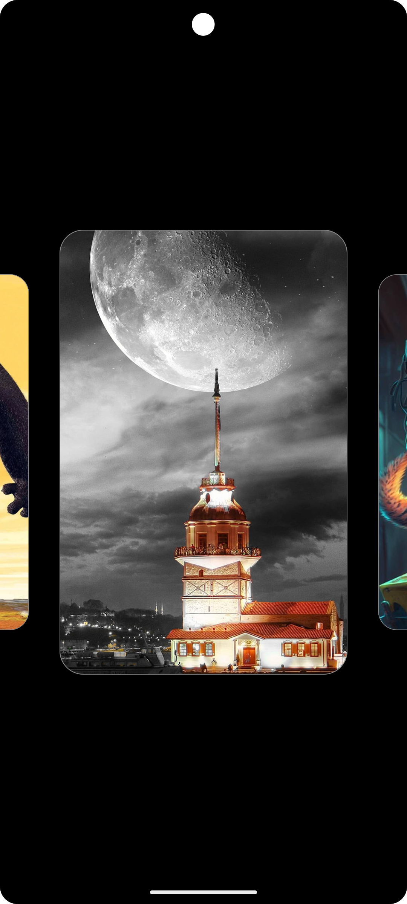

# Image Slider

## Ekran Görüntüsü




## Özellikler

- 🖼️ Yatay kaydırmalı görsel galerisi
- ✨ Smooth animasyonlar ve geçiş efektleri
- 🔄 Asenkron görsel yükleme
- 📱 Responsive tasarım
- 🎨 Modern Material Design 3
- 🎯 Gesture tabanlı etkileşim

## Teknolojiler

- Kotlin
- Jetpack Compose
- Coil (Görsel yükleme)
- Material Design 3
- Coroutines

## Kurulum

1. Projeyi klonlayın:
```bash
git clone https://github.com/kullaniciadi/ImageSlider.git
```